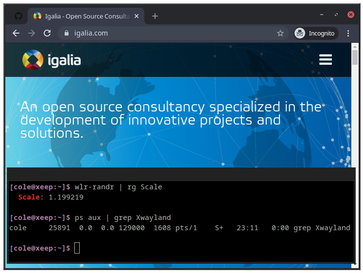

# nixpkgs-chromium

(related: [nixpkgs-wayland](https://github.com/colemickens/nixpkgs-wayland))

## Overview

This is a Nix package set meant for NixOS users on the `nixos-unstable` channel.
It currently contains a single package: `chromium-dev-ozone` which is Chromium built with Ozone (with x11/wayland enabled).

I will try to update this monthly at least. Since this is a package set, at worst you'll have
some local bloat, but you won't ever accidentally have to rebuild chromium like might happen with an overlay.



(This screenshot shows Chromium running on a Wayland output scaled to `1.2`.
If this were XWayland it would be noticeable blurry.)

## Repo Explanation

This is only possible because of [volth]'s `nixpkgs-windows` repo and the `chromium-git` branch. I clone this into `./nixpkgs-windows`,
wrote and carry a small patch that lets me re-use some of the nix functions inside volth's work. (This patch is also then extracted and
available in the repo to show how small it is.). This patched derivation exists at `./pkgs/chromium-git/vendor-chromium-git`.

`./update-chromium-version.sh` use `git` to determine the newest upstream chromium git
and writes it into `./pkgs/chromium-git/metadata.nix`. It then calls volth's perl script
to determine and write out the` vendor-{version}.nix` lock file, if it hasn't already been generated.

`./update.sh` updates the nixpkgs ref, calls `./update-chromium-version.sh` and then builds chromium + pushes to cachix.

## Packages

 * `chromium-dev-ozone` - Chromium with Ozone (x11/wayland) and GTK/Glib enabled

## Usage

#### Cachix

See the usage instructions on [nixpkgs-wayland.cachix.org](nixpkgs-wayland.cachix.org) for instructions on how to use the Cachix binary cache so that you don't have to build `chromium-dev-wayland` yourself. (`nixpkgs-wayland` is correct, we're using it for `nixpkgs-chromium` packages as well.)

#### Usage

Quick test:

```nix-env -iA chromium-dev-ozone -f "https://github.com/colemickens/nixpkgs-chromium/archive/master.tar.gz"```

Using in your nixos `configuration.nix`:

```nix
{ pkgs, ...}:

let
  chrpkgsBall = builtins.fetchTarball { url = "https://github.com/colemickens/nixpkgs-chromium/archive/master.tar.gz"; };
  chrpkgs = import chrpkgsBall;
in
{
  config = {
    nix = {
      # this is correct, we're using `nixpkgs-wayland` to cache `nixpkgs-chromium` packages
      binaryCachePublicKeys = [ "nixpkgs-wayland.cachix.org-1:3lwxaILxMRkVhehr5StQprHdEo4IrE8sRho9R9HOLYA=" ];
      binaryCaches = [ "https://nixpkgs-wayland.cachix.org" ];
    };

    environment.systemPackages = [ chrpkgs.chromium-dev-ozone ];
  };
}
```

## Credit

Credit to @volth for doing the hard work of writing a `chromium-git` derivation: https://github.com/NixOS/nixpkgs/pull/66438

